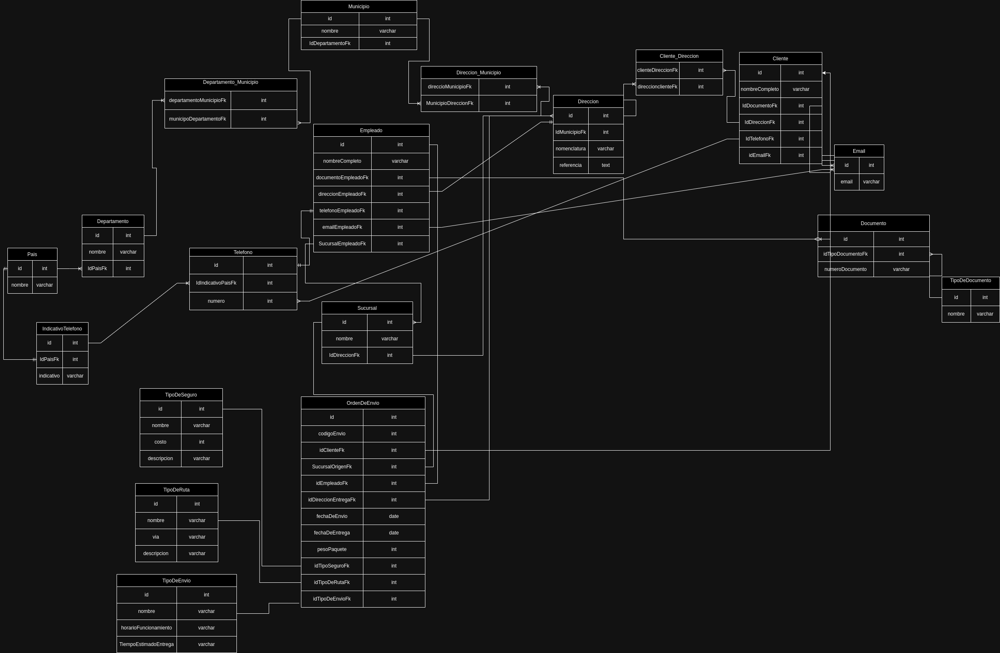

# BACKEND SOLUCIONESSERVIENTREGA

Este proyecto Solcuiona  la estrucutracion basica para el envio, reparto y seguimineto de los paquetes a nivel nacional e internacional.

# DIAGRAMA



# DEPENDENCIAS IMPLEMENTADAS

```JSON
        "class-transformer": "0.5.1",
        "class-validator": "0.14.0",
        "cookie-parser": "1.4.6",
        "dotenv": "16.3.1",
        "express": "4.18.2",
        "express-query-boolean": "2.0.0",
        "express-rate-limit": "6.8.1",
        "express-routes-versioning": "^1.0.1",
        "express-session": "1.17.3",
        "express-validator": "7.0.1",
        "jose": "4.14.4",
        "mongodb": "5.7.0",
        "nodemon": "3.0.1",
        "passport": "0.6.0",
        "passport-http-bearer": "1.0.1"
```

<br><br>

# IMPLEMENTACION PROYECTO

### CLONACION DEL REPOSITORIO

Clonamos el repositorio con visual estudio code y lo guardamos en una carpeta de nuestra elección

```
https://github.com/JoseCabrejoVillarCampus/PushUpServientrega```

<br><br>


### INSTALACION DE DEPENDENCIAS

Para Usar las Dependencias que estan en el package.json :

```
npm install
```

<br><br>

# CONFIGURACION DEL .env

Dentro de la Ruta que creamos para alojar el proyecto buscamos  el  archivo llamado ".env.example" y lo cambiamos por ".env"
En el archivo .env, configurar las siguientes variables de conexión a la base de datos:

```
MY_CONNECT:{"host":"","database":"", "user":"", "password":""}
MY_CONFIG:{"hostname":"", "port":}
JWT_PRIVATE_KEY:""
```

En el campo de MY_SERVER ingrese un hostname y un puerto a su elección(preferiblemente mayor al 5000). Recuerde que por defecto el local host requiere que el hostname es 127.0.0.1. pero puede ser,
ATLAS_USER es el usuario de la base de datos registrado en Atlas y ATLAS_PASSWORD es la contraseña que le asignamos, ATLAS_DB es el nombre de la base de datos y el JWT_PRIVATE_KEY es la palabra secreta que usaremos para generar los tokens de JWT

Hemos Creado un Usuario con acceso a la db de Moongo npara el testeo:

``` SQL
MY_CONNECT:{"host":"","database":"", "user":"", "password":""}
MY_CONFIG:{"hostname":"", "port":}
JWT_PRIVATE_KEY:""
```

<br><br>

# INICIAR tsc

Es necesario corre el tsc para que se creen los controladores

```
npm run tsc
```

# INICIAR nodemon

```
npm run dev
```

<br><br>

# END POINTS CRUD

## GETS

### TABLAS DISPONIBLES 

```sql
ClienteDireccion = direccionCliente
Cliente = clientes
Departamento = departamento
DepartamentoMunicipio = departamentoMunicipios
Direccion = direcciones
DireccionMunicipio = direccionMunicipio
Documento = documentos
Email = emails
Empleado = empleados
IndicativoTelefono = indicativo
Municipio = municipios
OrdenDeEnvio = ordenesenvio
Pais = paises
Sucursal = sucursal
Telefono = telefonos
TipoDeEnvio = tipoenvio
TipoDeRuta = tiporuta
TipoDeSeguro = tiposeguro
TipoDocumento= tipo_de_documentos
``` 

### Ejemplo

```
http://{localhost}:{port}/cliente/:id?
```

Donde el id es opcional para consultas por id